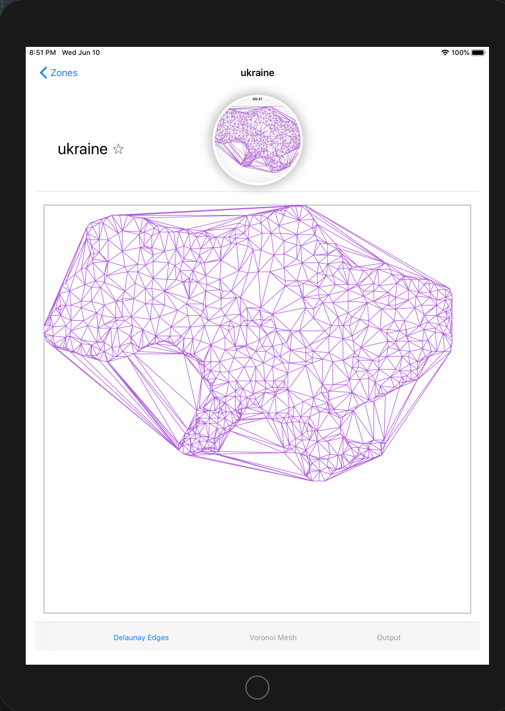
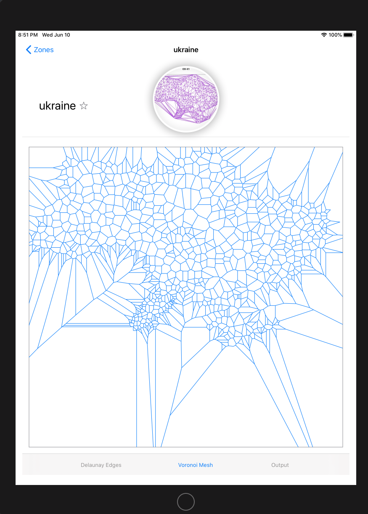

# Delaunator_Swift
A port of the [Delaunator](https://github.com/mapbox/delaunator) javascript library of [mapbox](https://github.com/mapbox) to the Swift programming language,

This library produces Delaunay triangulations (or the dual Voronoi Mesh) for a set of points defined in an input JSON file; included is a bare bones SwiftUI renderer which will show these structures.



When a triangulation includes near degenrate triangles, i.e. almost collinear, the
points which define the Voronoi diverge will diverge to infinity; making rendering the
Voronoi mesh numerically unstable. But for less extreme triangulations the Voronoi Mesh
will be well behaved.



## Example

The bare minimum usage example would be
```swift
// Delaunator_Swift always uses coordinates of type => struct Point: Hashable, Codable { var x, y: Double }
let list = [Point(x:0.0, y:0.0), Point(x:1.0, y:0.0), Point(x:1.0, y:1.0), Point(x:0.0, y:1.0)] // [{x 0, y 0}, {x 1, y 0}, {x 1, y 1}, {x 0, y 1}]

// Calculate the triangulation
var delaunay = Delaunator_Swift(from: list)

// The output
print(delaunay.triangles) // [0, 2, 1, 0, 3, 2]\n"
print(delaunay.halfEdges) // "[5, -1, -1, -1, -1, 0]\n"
print(delaunay.hull)      // "[0, 3, 2, 1]\n"
```

## Install

If you have Swift5.2 you just need the `Delaunator.swift` file for basic
usage. You can simply open it in a playground.

## Extras

Most of the files are for efficient input, output and a very simple rendering app
for SwiftUI. Data can be input using JSON formatted files; if you want to do this
but don't need the renderer you will need the `Zone.swift` file too.

Each zone has a name, and to do anything useful with it a provided list of points.
The example above using JSON would be - the data is decoded as a `StoredZones`
struct. Again you can try this out in a playground.

```swift
let jsonData = """
{
"zones": [
{
"name": "square",
"points": [[0, 0], [1, 0], [1, 1], [0, 1]]
}
]
}
""".data(using: .utf8)!

do {
  let stored:StoredZones = try JSONDecoder().decode(StoredZones.self, from:jsonData)
  print(stored)

  // Creating a zone from the stored zone
  let zone:Zone = Zone(from: stored.zones[0])

  // Create the point list
  var points = [Point]()
  let list   = zone.points ?? [[Double]]()
  for (_, p) in list.enumerated() {
    points.append(Point(x:p[0], y:p[1]))
  }

  // This is the triangulation step
  var delaunay = Delaunator_Swift(from: points)

  // The output
  print(delaunay.triangles) // [0, 2, 1, 0, 3, 2]\n"
  print(delaunay.halfEdges) // "[5, -1, -1, -1, -1, 0]\n"
  print(delaunay.hull)      // "[0, 3, 2, 1]\n"

}
catch { () }

```

## API Reference

#### Delaunator_Swift(from: [Point])

Constructs a delaunay triangulation object given an array of points `Point(x:Double, y:Double)`


#### delaunay.triangles

An array `[Int]` of triangle vertex indices (each group of three numbers forms a triangle).
All triangles are directed anticlockwise.

#### delaunay.halfedges

An array `[Int]` of triangle half-edge indices that allows you to traverse the triangulation.
`i`-th half-edge in the array corresponds to vertex `triangles[i]` the half-edge is coming from.
`halfedges[i]` is the index of a twin half-edge in an adjacent triangle
(or `-1` for outer half-edges on the convex hull).

The flat array-based data structures might be counterintuitive,
but they're one of the key reasons this library is fast.

#### delaunay.hull

An `[Int]` array of indices that reference points on the convex hull of the input data, counter-clockwise.

## More details

Comprehensive details on the data structures used are available via [mapbox](https://mapbox.github.io/delaunator/)
